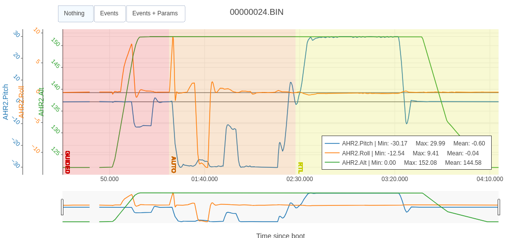
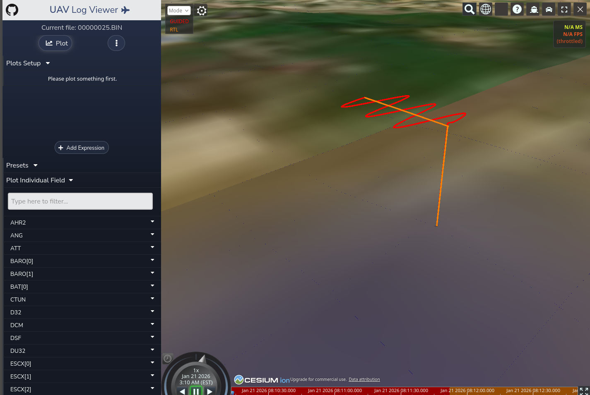
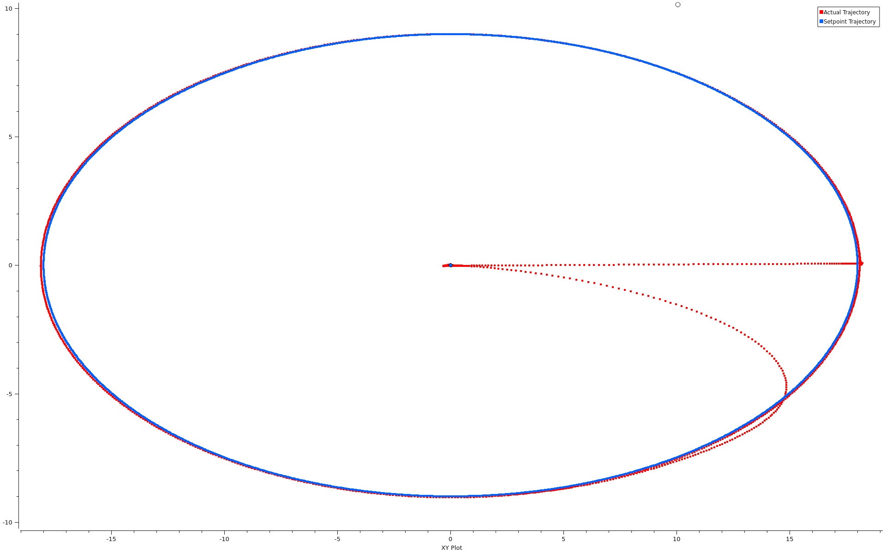
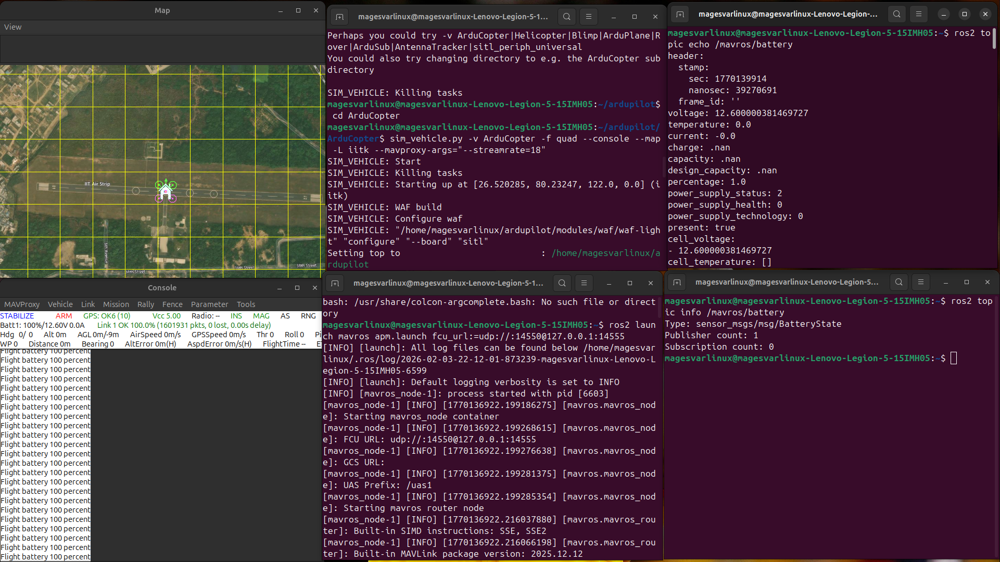
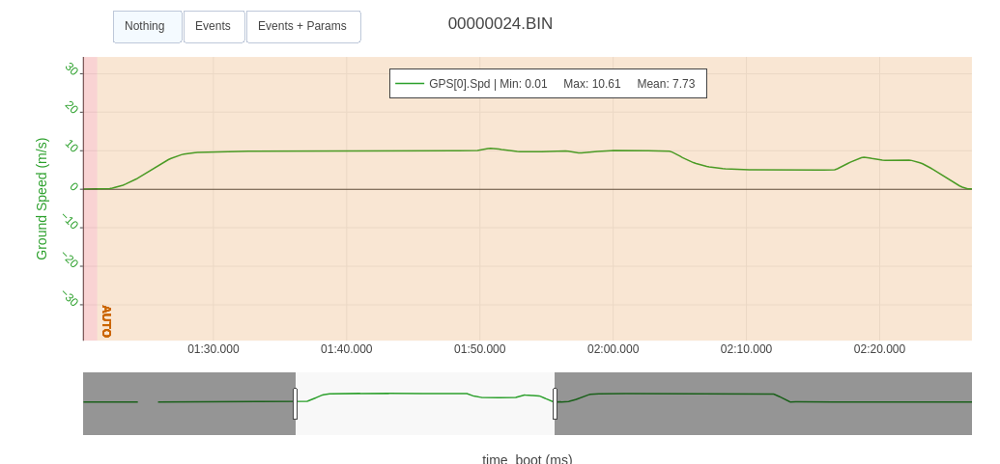

# 🚁 **Quadrotor SITL Flight & MAVROS Integration Lab**

### **Wind-disturbance flight testing, closed-loop trajectory generation, and ROS 2 / MAVROS telemetry integration for a simulated quadrotor UAV**

---


**Three self-contained flight experiments — wind-disturbance response, sine and elliptical trajectory tracking, and a full MAVROS sensor/control topic survey — all run on ArduPilot SITL and analyzed from raw flight logs.**

## Results preview

| Complete mission (roll / pitch / altitude) | Sine-wave trajectory (DroneKit) |
|---|---|
|  |  |

| Elliptical trajectory tracking (MAVROS) | MAVROS topic echo (battery state) |
|---|---|
|  |  |

---

## Overview

This project explores quadrotor flight behavior and the software stack around it, entirely in
simulation on ArduPilot SITL (ArduCopter). It's organized as three independent experiments:

1. **[Wind Disturbance Response & Trajectory Generation](experiments/01-wind-disturbance-and-trajectory/)** —
   characterizes how a quadrotor's roll, pitch, current draw, and groundspeed respond to injected
   wind across a multi-waypoint mission, then generates an open-loop sine-wave ground trajectory
   via DroneKit.
2. **[MAVROS / ROS 2 Interface Exploration](experiments/02-mavros-ros2-interface/)** — a hands-on
   survey of the ROS 2 command-line tools used to inspect a live MAVROS bridge, plus a full
   breakdown of the sensor and control topics MAVROS exposes.
3. **[Elliptical Trajectory Tracking over MAVROS](experiments/03-ellipse-trajectory-tracking/)** —
   a closed-loop ROS 2 controller that commands a quadrotor around an elliptical path using MAVROS
   position setpoints.

Each experiment folder is self-contained: source report (where one exists), reproduction steps,
and the raw screenshots, plots, and logs backing its findings.

---

## Experiment 1: Wind Disturbance Response & Trajectory Generation

Full report: [`experiments/01-wind-disturbance-and-trajectory/report.pdf`](experiments/01-wind-disturbance-and-trajectory/report.pdf)

### Setup

- ArduPilot SITL running ArduCopter (`quad` frame), driven through the MAVProxy console and map
- A 7-waypoint autonomous mission (WP1–WP7) flown in `AUTO` mode, with the vehicle holding a 90°
  bearing throughout (yawing right from north-facing to east-facing shortly after launch)
- Wind injected via ArduPilot's simulated wind parameters on three of the seven legs, with the
  remaining legs flown as a zero-wind baseline:
  - **WP1 → WP2** — 8 m/s crosswind (north → south, across the direction of travel)
  - **WP3 → WP4** — 8 m/s tailwind (west → east, aligned with the direction of travel)
  - **WP5 → WP6** — 8 m/s headwind (east → west, opposing the direction of travel)
- Flight recorded to DataFlash (`.BIN`) and MAVLink telemetry (`.tlog`), analyzed leg-by-leg in
  UAV Log Viewer

### Reproduce

```bash
sim_vehicle.py -v ArduCopter --console --map
# in the MAVProxy console
mode guided
arm throttle
takeoff 30
mode auto                          # fly the planned 7-waypoint mission
param set SIM_WIND_SPD 8
param set SIM_WIND_DIR <bearing>   # set per wind leg, clear before the next zero-wind leg
mode rtl
```

Logs land under the SITL working directory (`*.BIN`, `mav.tlog`) — load either into UAV Log
Viewer to reproduce the plots below.

### Results

**Full mission overview**


Mean pitch −0.60°, mean roll −0.04°, altitude ranging 0–152 m across the mission.

**Groundspeed across the mission**



Groundspeed ranged from 0.01 to 10.61 m/s (mean 7.73 m/s), dipping on the headwind leg and
showing a small peak on the tailwind leg.

**Per-leg roll / pitch response**

| Leg | Condition | Mean roll | Mean pitch | Observation |
|---|---|---|---|---|
| Launch → WP1 | Zero wind | ~0° | −23.65° | Baseline forward-flight pitch |
| WP1 → WP2 | Crosswind | −9.19° | −27.60° | Rolled ~9° into the wind to hold ground track |
| WP2 → WP3 | Zero wind | ~0° | −29.41° | Baseline |
| WP3 → WP4 | Tailwind | ~0° | −17.38° | Pitch eases — tailwind assists forward motion |
| WP4 → WP5 | Zero wind | ~0° | −24.48° | Baseline |
| WP5 → WP6 | Headwind | ~0° | −30.00° | Steepest pitch of the mission, countering headwind |
| WP6 → WP7 | Zero wind | ~0° | −11.22° | Pitch eases toward hover near the final waypoint |

Individual per-leg plots are in
[`results/`](experiments/01-wind-disturbance-and-trajectory/results/)
(`roll-pitch-leg*-*.png`, `current-leg*-*.png`).

**Power consumption**

3S battery (12.6 V nominal). Current and power are the peak values recorded on each leg:

| Leg | Current (A) | Power (W) | Remarks |
|---|---|---|---|
| Launch → WP1 | 31.13 | 392.24 | Nominal cruise |
| WP1 → WP2 | 31.31 | 394.51 | Crosswind — higher than nominal |
| WP2 → WP3 | 31.35 | 395.01 | Nominal cruise |
| WP3 → WP4 | 30.79 | 387.95 | Tailwind — lower than nominal |
| WP4 → WP5 | 30.78 | 387.83 | Nominal cruise |
| WP5 → WP6 | 31.35 | 395.01 | Headwind — highest power draw of the mission |
| WP6 → WP7 | 31.23 | 393.50 | Nominal cruise |

Even a couple of the nominal-wind legs show slightly elevated current, most likely from small
timing mismatches between manually toggling the wind parameters and the vehicle's waypoint
transitions.

**Discussion**

Roll response was small and largely confined to the crosswind leg, where the vehicle banked ~9°
into the wind to hold its ground track — the tailwind and headwind legs, by contrast, showed
almost no roll, since those disturbances acted along the direction of travel rather than across
it. Pitch told the clearer story: tailwind reduced the forward pitch needed to hold groundspeed,
while headwind pushed pitch to its steepest value of the mission (−30°) as the vehicle worked to
maintain commanded speed into the wind. Current draw tracked pitch closely, peaking on the
headwind leg and easing on the tailwind leg.

### Sine-wave trajectory generation (DroneKit)

[`scripts/sine_trajectory.py`](experiments/01-wind-disturbance-and-trajectory/scripts/sine_trajectory.py)
connects to the running SITL instance over DroneKit, arms the vehicle, climbs to 30 m, and then
commands a sine-wave ground track by feeding `simple_goto()` a stream of waypoints generated from
a local-tangent-plane NED → lat/lon conversion:

- Amplitude: 10 m (East)
- Forward speed: 0.5 m/s (North)
- Sine frequency: 0.05 Hz
- Commanded groundspeed: 3 m/s, at a 5 Hz setpoint rate, for 60 s

```bash
sim_vehicle.py -v ArduCopter --console --map
python3 scripts/sine_trajectory.py
```


The resulting ground track, visualized in UAV Log Viewer, shows the vehicle weaving east/west
around its forward path at the commanded amplitude and frequency.

---

## Experiment 2: MAVROS / ROS 2 Interface Exploration

Full reports:
[`report-command-line-exploration.pdf`](experiments/02-mavros-ros2-interface/report-command-line-exploration.pdf) ·
[`report-topics-analysis.pdf`](experiments/02-mavros-ros2-interface/report-topics-analysis.pdf)

### Setup

```bash
sim_vehicle.py -v ArduCopter -f quad --console --map --mavproxy-args="--streamrate=18"
ros2 launch mavros apm.launch fcu_url:=udp://:14550@127.0.0.1:14555
```

### Command-line exploration

A walk through the ROS 2 CLI tools used to inspect and exercise a live MAVROS bridge:

| Command | Purpose |
|---|---|
| `ros2 topic list` | Enumerate every topic MAVROS exposes |
| `ros2 service list` | Enumerate services exposed by `mavros_node` |
| `ros2 topic hz /mavros/local_position/pose` | Measure a topic's publish rate |
| `ros2 topic echo /mavros/state` | Stream live vehicle state (armed, mode, FCU connection) |
| `ros2 topic info /mavros/battery` | Show a topic's message type and publisher/subscriber counts |
| `ros2 topic bw /mavros/local_position/pose` | Measure a topic's bandwidth |
| `env \| grep ROS` | Inspect the active ROS 2 environment variables |
| `ros2 interface list` | List available message/service/action interfaces |
| `timeout 30s ros2 bag record -o combined_sitl_data /mavros/local_position/pose /mavros/state /mavros/imu/data` | Record a 30 s rosbag of three topics |
| `ros2 bag play combined_sitl_data` | Replay the recorded bag |

Full terminal output for each command is in
[`results/commands/`](experiments/02-mavros-ros2-interface/results/commands/). The recorded bag
itself is in [`data/combined_sitl_data/`](experiments/02-mavros-ros2-interface/data/combined_sitl_data/).

### MAVROS topic survey

`ros2 topic echo <topic>` subscribes and matches the topic's QoS profile to print incoming
messages; `ros2 topic info <topic>` reports the message type and the number of publishers and
subscribers currently attached. Applying both to the ten topics below produced the screenshots in
[`results/topics/`](experiments/02-mavros-ros2-interface/results/topics/).

**Sensor topics**

| Topic | Message type | Description |
|---|---|---|
| `/mavros/imu/data` | `sensor_msgs/msg/Imu` | Fused IMU data from the EKF — orientation (quaternion), angular velocity, linear acceleration. Used for stabilization and state estimation. |
| `/mavros/global_position/global` | `sensor_msgs/msg/NavSatFix` | Global position (lat/lon/alt) fused by the EKF from multiple sensors including GPS. Used for mission planning and geofencing. |
| `/mavros/battery` | `sensor_msgs/msg/BatteryState` | Voltage, temperature, current, and related battery parameters. Used for failsafes and power monitoring. |
| `/mavros/imu/mag` | `sensor_msgs/msg/MagneticField` | Raw magnetic field strength on X/Y/Z. Used for yaw correction, and can flag proximity to high-voltage lines or metal objects. |
| `/mavros/imu/temperature_baro` | `sensor_msgs/msg/Temperature` | Ambient temperature from the barometer's internal thermal sensor. Used for barometric altitude compensation and flight-controller temperature monitoring. |

**Control topics**

Unlike sensor topics, control topics publish nothing on subscribe by default — they wait for an
external node to publish setpoints.

| Topic | Message type | Description |
|---|---|---|
| `/mavros/setpoint_position/local` | `geometry_msgs/msg/PoseStamped` | Target local position and yaw sent to the flight controller. Used for trajectory tracking and waypoint navigation. |
| `/mavros/setpoint_position/global` | `geographic_msgs/msg/GeoPoseStamped` | Target global position (lat/lon/alt). Used for global navigation. |
| `/mavros/setpoint_velocity/cmd_vel_unstamped` | `geometry_msgs/msg/Twist` | Velocity command in x/y/z plus yaw rate, for direct linear/angular velocity control. |
| `/mavros/setpoint_velocity/cmd_vel` | `geometry_msgs/msg/TwistStamped` | Same velocity command as above, wrapped in a header (timestamp + frame_id) for time-synchronized control. |
| `/mavros/setpoint_raw/attitude` | `mavros_msgs/msg/AttitudeTarget` | Attitude target (quaternion orientation), body rates, and collective thrust sent directly to the flight controller — used for high-performance maneuvers and custom control loops. |

---

## Experiment 3: Elliptical Trajectory Tracking over MAVROS

A closed-loop follow-up to Experiment 2: a ROS 2 node
([`controller.py`](experiments/03-ellipse-trajectory-tracking/controller.py)) that arms the
vehicle, takes off, and drives it around a closed elliptical path by publishing `PoseStamped`
setpoints to `/mavros/setpoint_position/local` at 20 Hz — `x = a·cos(θ)`, `y = −b·sin(θ)` — with a
36 m semi-major axis, an 18 m semi-minor axis, and θ advancing at 0.009 rad/s for three full
clockwise laps before handing off to `RTL`.


The vehicle tracked the commanded sine/cosine setpoints with no significant steady-state error and
closed the loop cleanly at the ellipse's center. Full write-up, build steps, and reproduction
commands: [`experiments/03-ellipse-trajectory-tracking/README.md`](experiments/03-ellipse-trajectory-tracking/README.md).

---

## Repo structure

```
.
├── README.md
├── LICENSE
├── assets/                                    # hero images for this README
└── experiments/
    ├── 01-wind-disturbance-and-trajectory/
    │   ├── report.pdf
    │   ├── results/                           # mission, current, roll/pitch, trajectory plots
    │   ├── scripts/
    │   │   └── sine_trajectory.py
    │   └── logs/                              # raw DataFlash + MAVLink telemetry logs
    ├── 02-mavros-ros2-interface/
    │   ├── report-command-line-exploration.pdf
    │   ├── report-topics-analysis.pdf
    │   ├── results/
    │   │   ├── commands/                      # CLI-exploration screenshots
    │   │   └── topics/                        # topic-echo / topic-info screenshots
    │   └── data/
    │       └── combined_sitl_data/            # recorded rosbag
    └── 03-ellipse-trajectory-tracking/
        ├── README.md
        ├── controller.py
        ├── results/
        │   └── trajectory_plot.png
        └── data/
            └── rosbag2_2026_02_06-23_15_33/   # recorded rosbag
```

## License

This project is licensed under the MIT License — see [LICENSE](LICENSE).
# -Quadrotor-SITL-Flight-MAVROS-Integration-Lab

